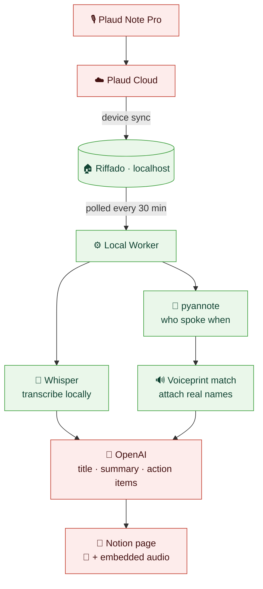
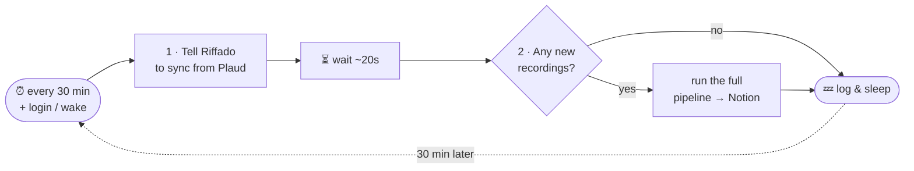
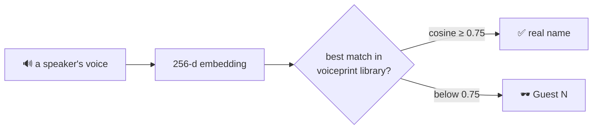

# 🎙️ → 📄 plaudautomation

> **Turns your Plaud voice recordings into polished, Circleback-style meeting notes in Notion — automatically, and privately.**

Everything heavy runs on **your own Mac**. A recording you make on a Plaud device shows up as a clean, searchable Notion page — with a title, summary, action items, named speakers, and the audio you can play back — **without you lifting a finger**.


> 📄 This README is the single source of truth — the working description of what we actually built.

---

## ⚡ At a glance

| | |
|---|---|
| 🏠 **Runs on** | Your Mac (Apple Silicon) — no server, no cloud worker |
| ⏰ **Schedule** | Every **30 minutes**, plus on login / wake |
| 🔌 **How it triggers** | **Polls** Riffado on a timer (no webhooks to maintain) |
| 🗣️ **Transcription** | **Local** Whisper (MLX `large-v3-turbo`) — audio never sent for transcription |
| 👥 **Speaker names** | **Local** voiceprint library (cosine ≥ 0.75) |
| 🤖 **Summaries** | OpenAI **gpt-5.5** (transcript text only) |
| 📄 **Output** | One Notion page per meeting, **with the audio embedded** |
| 🔒 **Privacy** | Audio + voiceprints stay local; only *transcript → OpenAI* and *audio → Notion* leave |

---

## 🗺️ The pipeline



<sub>🟩 green = runs **on your Mac** · 🟥 red = **leaves the machine** (Plaud is unavoidable; OpenAI gets text only; Notion gets the page + audio).</sub>

The project's job **ends** when the note is in Notion. Task routing, digests, and everything downstream are handled by automation that already exists.

---

## 🧠 How it works, in plain English

1. **🎙️ You record** a meeting on your Plaud Note Pro.
2. **☁️ Plaud syncs** the recording to Riffado, a self-hosted app running locally on your Mac (this is the only third party in the chain, and it's unavoidable with Plaud).
3. **⏰ Every 30 minutes** a background agent wakes up and asks Riffado, "anything new?"
4. **📝 Transcribe** — new audio is transcribed *on your Mac* with Whisper. Nothing is uploaded to transcribe.
5. **👥 Figure out who spoke** — the audio is split into speakers, and each voice is matched against a private **voiceprint library** to attach real names (or "Guest" if it's not confident).
6. **🤖 Summarize** — the labeled transcript text goes to OpenAI, which writes a short **title**, an **overview**, **topic sections**, and **action items** (always in English).
7. **📄 Publish** — a Notion page is created under "Other Meeting Central" with the notes, an attendees list, the full transcript, and the **recording embedded so you can press play**.

That's it. As long as your Mac is on, notes appear by themselves — usually within ~30 minutes of a recording reaching Riffado.

---

## ⏰ When it runs (automation)

Driven by a **`launchd` agent** (`com.plaudautomation`). It is **polling, not push** — Plaud/Riffado never notify us; the agent checks on a timer.



- **Cadence:** every **30 minutes** (`StartInterval 1800`) **+ at login and on wake** (`RunAtLoad`). A sleeping Mac defers the timer and fires it on wake, so it self-catches-up after sleep.
- **Idempotent:** a local processed-ledger means reruns **update a page in place, never duplicate**, and a skip-list (`state/skip_recordings.txt`) ignores junk recordings.
- **Latency:** ≤ ~30 min from a recording landing in Riffado to a finished Notion page.
- **Logs:** `worker/state/automation.log` (currently clean 30-min cycles, 0 failures).

> [!IMPORTANT]
> **Two caveats on "fully automated":**
> - 🖥️ The agent only runs while **this Mac is on and awake** (it's a user LaunchAgent, not a server). Powered off ⇒ nothing runs until it's back, then it catches up.
> - 🔁 The **Plaud device → Riffado** hop is Plaud's *own* sync, not ours. A recording must reach Riffado before we can touch it; everything after that is automatic.

**Install / manage:**
```bash
cp deploy/launchd/com.plaudautomation.plist ~/Library/LaunchAgents/
launchctl load   ~/Library/LaunchAgents/com.plaudautomation.plist   # enable
launchctl unload ~/Library/LaunchAgents/com.plaudautomation.plist   # pause
tail -f worker/state/automation.log                                          # watch it run
```

> Riffado *can* emit signed webhooks, but we deliberately use the simpler **poll-on-a-timer** model — no inbound listener to keep alive, and 30 min is well within tolerance for meeting notes.

---

## 🔒 Privacy at a glance

The whole point: **sensitive data stays on the machine**, with two narrow, deliberate exceptions.

| Data | Where it goes | Leaves your Mac? |
|---|---|---|
| 🔊 Raw audio (transcription) | Local Whisper | ❌ Never |
| 🧬 Voiceprints (biometric) | Local SQLite | ❌ **Never** |
| 👥 Diarization / speaker matching | Local pyannote | ❌ Never |
| 📝 Transcript **text** | OpenAI (for summary) | ✅ *Approved exception* |
| 📎 Recording **audio** | Notion (embedded, playable) | ✅ *Approved exception (Jun 2026)* |
| 🗂️ Recordings, keys, logs | — | ❌ Never to Riffado's author or anyone else |

- **Riffado is read-only to us**, and its maintainer receives nothing — no recordings, transcripts, keys, or logs.
- **Plaud Cloud** is the one unavoidable third party (it's how the device syncs at all).
- Riffado UI is bound to `127.0.0.1`; S3/SMTP/external webhooks are disabled; secrets live in a shared `secrets.env` that is never committed.

---

## 👥 Who's talking — speaker identification (voiceprint-only)

Riffado's transcript has **no speaker labels**, so naming people is ours to do — **without any calendar or call-history access**.



- **Diarization** (who-spoke-when) runs locally (pyannote 3.1), producing a 256-d embedding per anonymous speaker.
- A **persistent local voiceprint library** (SQLite) stores known people and names speakers across **in-person, phone, and WhatsApp** recordings alike.
- **Multi-prototype matching (precision-first):** each person keeps *every* enrolled raw sample as its own **prototype** (one per acoustic condition), plus a running-average centroid as fallback. A new voice scores against the **best-matching prototype**, not a washed-out average — so the same person on a phone vs in-room still matches their closest sample.
- **Threshold = cosine ≥ 0.75**, calibrated by leave-one-out over the library (0.55 admitted ~14/44 impostor matches and caused real mis-attributions; 0.75 cuts that sharply while genuine speakers still clear it). Below threshold a voice stays an ephemeral **`Guest N`** rather than risk a wrong name. *We deliberately prefer more Guests over a mis-attribution.*
- **Watch a second failure mode:** a speaker matching a *wrong* name at ~**1.000** means a prototype was mislabeled during enrollment — fix by relabeling that `prototypes` row, **not** by raising the threshold.

**How names get attached, no metadata required:**
- *You are the anchor* — the voice present in the most recordings is auto-named (the device owner).
- *Back-catalog clustering* — agglomerative complete-linkage clustering (cosine, 0.55) groups each person; complete linkage guarantees distinct people are never merged.
- *Snippet-once naming* — `scripts/snippet_unknowns.py` stitches a ~25 s clip of each recurring unidentified voice; you listen, name it once, and it **back-fills every past and future recording**.
- **Speaker Directory** (a Notion page) lists every named person and the meetings they appear in. Rename once (`scripts/rename_speaker.py`) → every page + the directory update.

---

## 🌐 Language handling

- **Transcript stays in the original spoken language.** Whisper detects only *one* language per file, so a meeting that opens in English would otherwise get its Chinese/Hindi speech **translated** to English. To prevent that, meetings detected as substantially **Chinese** (≥ ~20% of sampled speaker-blocks) are transcribed **per speaker-block**, keeping each speaker's Chinese/English verbatim.
- **Hindi/Hinglish stays on the fast single pass** — per-block there produced ~44% loop/garble junk on rapidly code-switched audio, so it's deliberately gated to Chinese only.
- **Title, overview, sections, and action items are always in English**, even for non-English meetings, so downstream automation and skimming stay consistent.

---

## 📄 What a finished note looks like

Every recording becomes one Notion child page, in the **identical Circleback template** your existing notes use:

```
┌──────────────────────────────────────────────────────┐
│ ✅ Patent Strategy & Inventory App | 02 Jun 26 | 21:33 │ ← AI-written title
├──────────────────────────────────────────────────────┤
│ ▶ ━━━━━━━━━━━━━━━━━ 0:00 / 27:14            🔊 audio   │ ← playable recording
│                                                        │
│ ### Overview            • crisp summary bullets…       │
│ ### <Topic>             • detailed bullets…            │
│ ### Action Items        ☐ Sam: **Send the spec**     │
│ ──────────────────────────────────────────────         │
│ 📋 Metadata   👥 Attendees (N)   🎙️ Full Transcript     │
└──────────────────────────────────────────────────────┘
```

**How the pipeline fills each section:**

| Template section | Source |
|---|---|
| 📎 Embedded audio | the recording's mp3, uploaded to Notion as a playable block |
| Title, Metadata (Date/Time/Duration) | **AI title** + Riffado `recorded_at`, `duration_ms` |
| Overview, Topics, Action Items | OpenAI over the speaker-labeled transcript |
| Action-item **owner** | our voiceprint identification (else blank, never `null`) |
| Attendees table | the set of identified speakers |
| Transcript labels (`**Name:**`) | local Whisper diarization + voiceprint match |

> Plaud has **no** attendee metadata at all — without our voiceprint step, *every* speaker and owner would be `Guest`/`null`. Identification is what makes these notes match the quality of real Circleback notes.

---

## ⚡ Caching & cheap re-renders

Transcription (MLX Whisper) and diarization (pyannote) are the slow stages. Everything is **cached on disk** keyed by recording id:

| Cache | Holds |
|---|---|
| `state/transcripts/` | single-pass transcript |
| `state/diar_full/` | diarization turns + embeddings |
| `state/ml_flag/` | Chinese-detection flag |
| `state/transcripts_ml/` | per-block multilingual turns |

Re-rendering after a voiceprint change re-identifies only — caches are reused for free, and just the OpenAI step re-runs. A full back-catalog re-render is **~30–45 min** once caches are warm.

---

## 🧾 Reference

<details>
<summary><b>✅ Verified Riffado facts (<code>openplaud/openplaud</code>)</b></summary>

> **Version floor: run ≥ 0.5.5.** 0.5.4/0.5.3 ship a rate-limiter bug (`ERR_INVALID_ARG_TYPE`) that crashes *every* `/api/v1/*` and `/api/plaud/sync` request — fixed in 0.5.5. We deploy **0.5.6**. Hardened, local-only config lives in [`deploy/riffado/`](deploy/riffado/).

| Claim | Status |
|---|---|
| Self-hosted, Docker Compose, AGPL-3.0 | ✅ |
| Supports Plaud Note / Note Pro / NotePin | ✅ |
| Syncs from Plaud cloud (email-OTP auth, AES-256-GCM at rest) | ✅ |
| Read-only `GET /api/v1/recordings`, `/[id]`, `/transcript`, `/audio` (`Bearer op_…`) | ✅ |
| Recording carries `id`, `recorded_at`, `duration_ms`, device info | ✅ |
| Signed webhooks: `recording.synced/…`, `transcription.completed/…` (HMAC-SHA256) | ✅ (we don't use them — we poll) |
| Transcript includes speaker/diarization data | ❌ text only → we diarize ourselves |
| Headless sync | ✅ server-side `POST /api/plaud/sync` → driven from `launchd` |

Sources: [openplaud/openplaud](https://github.com/openplaud/openplaud) · [openplaud.com](https://openplaud.com/) · repo `docs/API.md`, `docs/AUTO_SYNC.md`.
</details>

<details>
<summary><b>🔐 Decisions locked</b></summary>

- **Sync layer:** self-hosted Riffado, driven headless via `POST /api/plaud/sync` from `launchd`.
- **Transcription:** local Whisper on Apple Silicon M1 Pro (MLX large-v3-turbo, ~real-time with Metal; pyannote diarization slower but fine).
- **Identification:** voiceprint-only (no calendar), multi-prototype matching at cosine ≥ 0.75, precision-first, seeded from the back-catalog.
- **Language:** transcript in the original spoken language (per-block for Chinese-heavy meetings; single-pass otherwise); summaries always in English.
- **Structuring:** OpenAI Personal key, `gpt-5.5` — pinned via `worker/.env` (`OPENAI_MODEL`), which overrides the shared `secrets.env`.
- **Destination:** child pages under "Other Meeting Central", reproducing Circleback's full template.
- **State store:** local SQLite (processed-ledger + voiceprint DB).
</details>

<details>
<summary><b>📦 Scope (in / out)</b></summary>

**In scope** — self-host Riffado locally; poll its read-only API on a 30-min timer; transcribe locally with Whisper; diarize + identify via the local voiceprint library; structure with OpenAI; write one idempotent Notion page per recording.

**Out of scope** — anything after the Notion write (existing automation owns it), Plaud hardware/consent policy, hosting Riffado publicly, S3/SMTP/webhooks-to-third-parties.
</details>

---

## 🚦 Status — all phases done ✅

| Phase | What | State |
|---|---|---|
| **1 · Riffado standup** | Self-hosted Riffado 0.5.6, security-gated (`127.0.0.1`-bound, no telemetry/S3/SMTP), back-catalog synced & encrypted at rest. See [`deploy/riffado/`](deploy/riffado/). | ✅ done |
| **2 · The worker** | Full local pipeline: Riffado API → MLX Whisper → pyannote → voiceprint ID (≥0.75) → gpt-5.5 (title+summary+actions) → Notion (Circleback template + embedded audio). Back-catalog reprocessed with the recurring speakers enrolled in the local voiceprint library. See [`worker/`](worker/). | ✅ done |
| **3 · Hands-free** | `launchd` agent live: **every 30 min + boot/wake** triggers a headless Riffado sync, then reconciles new recordings into Notion. Polling, not webhooks. See [`deploy/launchd/`](deploy/launchd/). | ✅ done |

**Remaining follow-ups**
- 🔍 **Definitive egress proof** — host outbound firewall (LuLu/Little Snitch) to confirm Plaud-only destinations and enforce the allowlist.
- ⏲️ **Riffado session lifetime** — how often the persisted sync cookie needs re-auth (only knowable as the headless sync runs over time).
