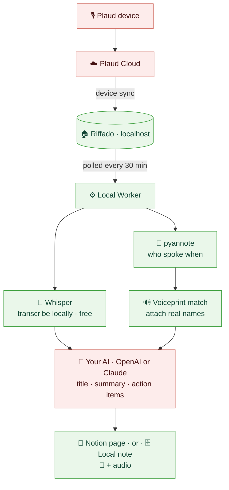
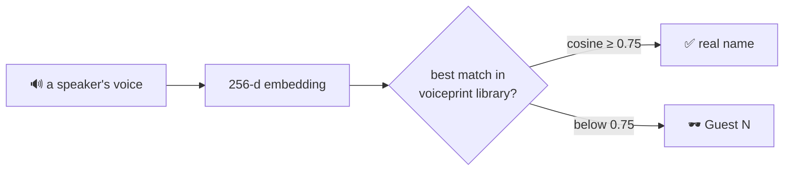
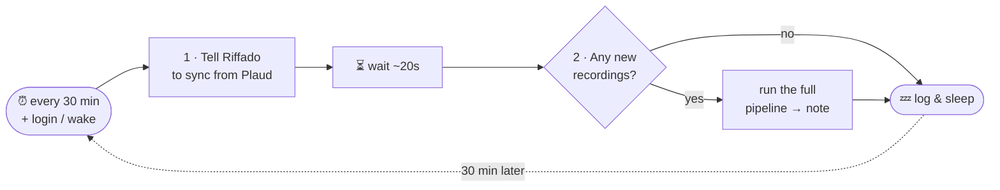

# 🎙️ → 📄 plaudautomation

> **Turns your Plaud voice recordings into clean, Circleback-style meeting notes — automatically, and privately, on your own Mac.**

Clone it, run `./run`, follow a short setup wizard, and a recording you make on a Plaud device turns into a tidy note — title, summary, action items, named speakers, and the audio you can play back — **without you lifting a finger**. Notes can land in **Notion** or in a **local notes app** on `localhost`. Everything heavy (transcription, speaker recognition) runs **on your Mac**; the only thing that ever leaves is the transcript text sent to the AI you choose for summaries.


> Apple-Silicon Macs, Python 3.12. The web app binds to `127.0.0.1` only.

---

## ⚡ At a glance

| | |
|---|---|
| 🏠 **Runs on** | Your Mac (Apple Silicon) — no server, no cloud worker |
| 🚀 **Setup** | `git clone` → `./run` → a browser **setup wizard** installs the pipeline and saves your choices |
| 📤 **Notes go to** | **Notion** *or* a **local notes app** (your choice in the wizard) |
| 🤖 **Summaries by** | **OpenAI** *or* **Claude** — your key, your model (cost shown up front) |
| 🗣️ **Transcription** | **Local** Whisper (MLX `large-v3-turbo`) — **free**, audio never sent to transcribe |
| 👥 **Speaker names** | **Local** voiceprint library (cosine ≥ 0.75); name voices right in the app |
| 🖥️ **The app** | A local web dashboard to browse notes, play audio, and name speakers |
| ⏰ **Schedule** | Every **30 minutes**, plus on login / wake (a `launchd` agent) |
| 🔒 **Privacy** | Audio + voiceprints stay local; only *transcript → your AI* (and *audio → Notion*, if you pick Notion) ever leave |

---

## 🚀 Quick start

```bash
git clone https://github.com/bestankit-sudo/plaud-notion-automation.git
cd plaud-notion-automation
./run
```

`./run` checks you're on an Apple-Silicon Mac, sets up a virtualenv, and opens a **setup wizard** in your browser. The wizard has two steps:

1. **Set up your Mac** — installs the local pipeline (Homebrew, ffmpeg, Python 3.12, the on-device ML stack, Docker + the Riffado sync app, and the background agents). Each step says *why it's needed* and *how*, and skips anything you already have.
2. **Configure** — pick where notes go (**Local** or **Notion**), which **AI** writes the summaries (**OpenAI** or **Claude**, with a cost estimate), and paste your keys. "Test" buttons check each one.

Click **Finish**, and the same URL becomes your **notes dashboard**. From then on it runs itself: every ~30 minutes the worker checks Riffado for new recordings and turns them into notes.

> The setup steps install real software on your Mac (Homebrew packages, a Docker container, background agents). The wizard streams each install's live log so you can see exactly what runs.

---

## 🖥️ The app

Once configured, `./run` (or the always-on background agent) serves a small local web app at **`http://127.0.0.1:8787`**:

- **Notes list + detail** — every meeting as a clean page: overview, topic sections, action items, attendees, the full transcript, and the **audio you can play back**.
- **Speaker Key** — the part that makes notes *yours*. For each voice in a meeting you can press ▶ to hear a snippet, type a name, and **Save**. Naming a voice **enrolls it locally**, so every *future* meeting auto-labels that person — and you can back-fill past meetings, **Undo** a mistake, or **rename everyone** in one click. No calendar or contact access; identity comes only from the voice.

It's a bookmarkable dashboard: visit the URL any time to see your latest notes. With the background "web" agent installed, it stays up even when you haven't run anything by hand.

---

## 🗺️ The pipeline



<sub>🟩 green = **on your Mac** · 🟥 red = **leaves the machine** (Plaud's own sync is unavoidable; your chosen AI gets transcript *text* only; Notion — if you pick it — also gets the audio).</sub>

---

## 🧠 How it works, in plain English

1. **🎙️ You record** a meeting on your Plaud device.
2. **☁️ Plaud syncs** the recording to **Riffado**, a self-hosted app running locally on your Mac (the only third party in the chain, and unavoidable with Plaud).
3. **⏰ Every 30 minutes** a background agent wakes up and asks Riffado, "anything new?"
4. **📝 Transcribe** — new audio is transcribed *on your Mac* with Whisper. **Nothing is uploaded to transcribe, and it costs nothing.**
5. **👥 Figure out who spoke** — the audio is split into speakers, and each voice is matched against your private **voiceprint library** to attach real names (or `Guest N` if it's not confident).
6. **🤖 Summarize** — the labeled transcript *text* goes to the AI you chose (OpenAI or Claude), which writes a **title**, **overview**, **topic sections**, and **action items** (always in English).
7. **📄 Publish** — a note is created in Notion or your local app, with the attendees, the full transcript, and the **recording you can play back**.

As long as your Mac is on, notes appear by themselves — usually within ~30 minutes of a recording reaching Riffado.

---

## 💸 What it costs

| | |
|---|---|
| 🎙️ **Transcription** | **Free** — runs locally on your Mac (MLX Whisper). |
| 👥 **Speaker ID** | **Free** — local voiceprints. |
| 🤖 **Summaries** | You pay your **AI provider** directly (OpenAI/Anthropic), per their token prices. |

The AI **only writes the summary** — it never transcribes. Cost scales with transcript length (meeting duration), so the wizard shows a **range per 100 meetings**, e.g. Claude Opus 4.8 ≈ **$5–$15 / 100 meetings**:

- **Low** ≈ a short (~20-min) English meeting.
- **High** ≈ a long (~70-min), dense, or non-English meeting (non-Latin scripts tokenize to noticeably more).
- The **number of speakers barely changes it** — content length is what matters.

Cheaper models (Haiku, GPT-5 mini/nano) drop this to cents per 100 meetings; the wizard lists every option with its own range so you can choose.

---

## 🔒 Privacy at a glance

The whole point: **sensitive data stays on the machine**, with narrow, deliberate exceptions you opt into during setup.

| Data | Where it goes | Leaves your Mac? |
|---|---|---|
| 🔊 Raw audio (transcription) | Local Whisper | ❌ Never |
| 🧬 Voiceprints (biometric) | Local SQLite | ❌ **Never** |
| 👥 Diarization / speaker matching | Local pyannote | ❌ Never |
| 📝 Transcript **text** | Your AI (OpenAI/Claude), for the summary | ✅ *The one egress for summaries* |
| 📎 Recording **audio** | Notion (embedded, playable) | ✅ *Only if you choose the **Notion** destination* |
| 🗂️ Recordings, keys, logs | — | ❌ Never to Riffado's author or anyone else |

- Choose the **Local** destination and **nothing but the transcript text** ever leaves (for the AI summary); the audio and everything else stay on `127.0.0.1`.
- **Riffado is read-only to us**, and its maintainer receives nothing.
- **Plaud Cloud** is the one unavoidable third party (it's how the device syncs at all).
- The web app binds to `127.0.0.1`; secrets are written to `worker/.env` at `chmod 600` and are never committed.

---

## 👥 Who's talking — speaker identification (voiceprint-only)

Riffado's transcript has **no speaker labels**, so naming people is ours to do — **without any calendar or call-history access**.



- **Diarization** (who-spoke-when) runs locally (pyannote 3.1), producing a 256-d embedding per anonymous speaker.
- A **persistent local voiceprint library** (SQLite) stores known people and names them across **in-person, phone, and call** recordings alike.
- **Multi-prototype matching (precision-first):** each person keeps *every* enrolled raw sample as its own **prototype** (one per acoustic condition), plus a running-average centroid as fallback. A new voice scores against the **best-matching prototype**, not a washed-out average.
- **Threshold = cosine ≥ 0.75**, calibrated by leave-one-out (0.55 admitted impostor matches; 0.75 cuts that sharply while genuine speakers still clear it). Below it, a voice stays an ephemeral **`Guest N`** rather than risk a wrong name — *we prefer more Guests over a mis-attribution.*
- **Name voices in the app:** the **Speaker Key** lets you hear a snippet and name a voice in one click. That enrolls it, so future meetings auto-label it; you can back-fill the past, **Undo**, or **rename across every meeting**. (CLI helpers in `worker/scripts/` do the same headlessly.)

---

## 🌐 Language handling

- **Transcript stays in the original spoken language.** Whisper detects only *one* language per file, so a meeting that opens in English would otherwise get its Chinese/Hindi speech **translated**. To prevent that, meetings detected as substantially **Chinese** are transcribed **per speaker-block**, keeping each speaker's Chinese/English verbatim.
- **Hindi/Hinglish stays on the fast single pass** (per-block produced loop/garble junk on rapidly code-switched audio, so it's gated to Chinese only).
- **Title, overview, sections, and action items are always in English**, even for non-English meetings, so skimming and downstream automation stay consistent.

---

## ⏰ When it runs (automation)

Driven by a **`launchd` agent** (`com.plaudautomation`). It is **polling, not push** — Plaud/Riffado never notify us; the agent checks on a timer.



- **Cadence:** every **30 minutes** (`StartInterval 1800`) **+ at login and on wake** (`RunAtLoad`). A sleeping Mac defers the timer and fires it on wake, so it self-catches-up.
- **Idempotent:** a local processed-ledger means reruns **update a note in place, never duplicate**; a skip-list ignores junk recordings.
- **Two agents:** the **worker** (the pipeline, every 30 min) and an always-on **web** agent that keeps the dashboard at `127.0.0.1:8787` up. The setup wizard installs both for you; the templates live in [`deploy/launchd/`](deploy/launchd/).
- **Logs:** `worker/state/automation.log`.

> [!IMPORTANT]
> **Two caveats on "fully automated":**
> - 🖥️ The agents only run while **this Mac is on and awake** (user LaunchAgents, not a server). Powered off ⇒ nothing runs until it's back, then it catches up.
> - 🔁 The **Plaud device → Riffado** hop is Plaud's *own* sync, not ours. A recording must reach Riffado before we can touch it; everything after that is automatic.

---

## 📄 What a finished note looks like

```
┌──────────────────────────────────────────────────────┐
│ ✅ Patent Strategy & Inventory App | 02 Jun 26 | 21:33 │ ← AI-written title
├──────────────────────────────────────────────────────┤
│ ▶ ━━━━━━━━━━━━━━━━━ 0:00 / 27:14            🔊 audio   │ ← playable recording
│                                                        │
│ ### Overview            • crisp summary bullets…       │
│ ### <Topic>             • detailed bullets…            │
│ ### Action Items        ☐ Sam: **Send the spec**     │
│ ──────────────────────────────────────────────         │
│ 📋 Metadata   👥 Attendees (N)   🎙️ Full Transcript     │
└──────────────────────────────────────────────────────┘
```

| Section | Source |
|---|---|
| 📎 Embedded / playable audio | the recording's mp3 (uploaded to Notion, or served locally) |
| Title, Date/Time/Duration | **AI title** + Riffado `recorded_at`, `duration_ms` |
| Overview, Topics, Action Items | your AI over the speaker-labeled transcript |
| Action-item **owner** | local voiceprint identification (else blank, never `null`) |
| Attendees + transcript labels | local Whisper diarization + voiceprint match |

> Plaud has **no** attendee metadata — without the local voiceprint step, *every* speaker and owner would be `Guest`/blank. Identification is what makes these match the quality of real Circleback notes.

---

## ⚡ Caching & cheap re-renders

Transcription (MLX Whisper) and diarization (pyannote) are the slow stages. Everything is **cached on disk** keyed by recording id (`state/transcripts/`, `state/diar_full/`, …). Re-rendering after you name a voice **re-identifies only** — caches are reused for free, and just the AI step (or a local relabel) re-runs.

---

## 🧾 Reference

<details>
<summary><b>✅ Verified Riffado facts (<code>openplaud/openplaud</code>)</b></summary>

> **Version floor: run ≥ 0.5.5.** 0.5.4/0.5.3 ship a rate-limiter bug that crashes every `/api/v1/*` request — fixed in 0.5.5. We deploy **0.5.6**. Hardened, local-only config lives in [`deploy/riffado/`](deploy/riffado/).

| Claim | Status |
|---|---|
| Self-hosted, Docker Compose, AGPL-3.0 | ✅ |
| Supports Plaud Note / Note Pro / NotePin | ✅ |
| Syncs from Plaud cloud (email-OTP auth, AES-256-GCM at rest) | ✅ |
| Read-only `GET /api/v1/recordings`, `/[id]`, `/transcript`, `/audio` (`Bearer op_…`) | ✅ |
| Transcript includes speaker/diarization data | ❌ text only → we diarize ourselves |
| Headless sync | ✅ server-side `POST /api/plaud/sync`, driven from `launchd` |

Sources: [openplaud/openplaud](https://github.com/openplaud/openplaud) · [openplaud.com](https://openplaud.com/).
</details>

<details>
<summary><b>🔐 Design decisions</b></summary>

- **Sync layer:** self-hosted Riffado, driven headless via `POST /api/plaud/sync`.
- **Transcription:** local Whisper on Apple Silicon (MLX `large-v3-turbo`); pyannote diarization.
- **Identification:** voiceprint-only (no calendar), multi-prototype matching at cosine ≥ 0.75, precision-first.
- **Language:** transcript in the original spoken language (per-block for Chinese-heavy meetings); summaries always English.
- **Summaries:** OpenAI **or** Anthropic, chosen in the wizard; your key, your model. Anthropic is restricted to structured-output models (opus-4-8 / sonnet-4-6 / haiku-4-5).
- **Destination:** Notion (Circleback-style template + embedded audio) **or** a local SQLite notes app served on `127.0.0.1`.
- **State store:** local SQLite (processed-ledger + voiceprint DB).
- **Secrets:** written to `worker/.env` (`chmod 600`); a shared `~/.config/env-variables/secrets.env` is honored as a fallback. Never committed.
</details>

<details>
<summary><b>📦 Scope (in / out)</b></summary>

**In scope** — self-host Riffado locally; poll its read-only API on a 30-min timer; transcribe locally with Whisper; diarize + identify via the local voiceprint library; summarize with your chosen AI; write one idempotent note per recording (Notion or local); a local web app to read notes and name speakers.

**Out of scope** — anything after the note is written, Plaud hardware/consent policy, hosting Riffado publicly, S3/SMTP/webhooks-to-third-parties.
</details>

---

## 🛠️ For developers

| | |
|---|---|
| `./run` | Bootstrap + launch the web app / wizard (Apple-Silicon gate, venv, uvicorn on `127.0.0.1:8787`) |
| `app/` | FastAPI web app — setup wizard, installer API, notes viewer, Speaker Key. Tests: `cd app && ../worker/.venv/bin/python -m pytest` |
| `worker/` | The pipeline (Riffado → Whisper → pyannote → voiceprints → summarizer → destination). Tests: `cd worker && .venv/bin/python -m pytest` |
| `deploy/` | Hardened Riffado compose config + the `launchd` agent templates |
| `docs/superpowers/` | Design specs + implementation plans |

Requires an Apple-Silicon Mac and Python 3.12. The web app is credential-free (it reads the local notes DB directly); only the worker holds provider keys.

---

## 📜 License

**MIT** — see [`LICENSE`](LICENSE). Note: Riffado (the self-hosted sync app this drives) is a separate **AGPL-3.0** project you run yourself; this repo only ships a hardened deployment config for it, not its code.

---

*Built local-first. Your recordings are yours.*
